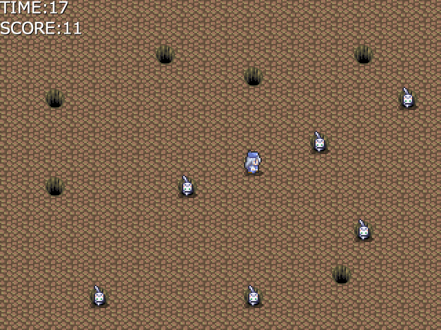

# らいむの game & music ポートフォリオ
## Shadowy Destiny
* 制作時期: 2021年～2022年
* ジャンル: 2DRPG
* 使用ソフト: WOLF RPGエディタ
* 概要: 既存のゲーム「テイルズオブデスティニー」、「テイルズオブデスティニー2」の二次創作ゲームです。登場人物は原作と同じですが、世界観は原作とは全く違うものになっています。ストーリーは、主人公の王国客員剣士リオン・マグナスが、リオンの助手として城に現れたスタン・エルロンと出会い、共に雪国に任務に出向くことになり、その先で何かが起こる…？というものです。
* 作品制作における工夫点: ゲーム性よりも"ストーリーを読む"ことを重視して制作しました。戦闘システムはソフトについているターン制のものを使用し、戦闘コマンドの名前や内容を原作に似た感じに変えました。原作ゲームでもおなじみである「スキット」のシステムを自作し、主軸のストーリーの他に移動中に特定のボタンを押すことでちょっとした会話が見られるようにしました。また、BGMは原作のものを使用したのですが、キャラクターの心情やストーリーの展開に合わせて音楽をフェードアウトさせたり突然停止させたりしてプレイヤーが物語に入り込みやすいようにしました。また、同じコンピュータ部の部員にテストプレイしてもらい、操作説明が足りないということだったため最初の戦闘開始時や移動開始時に説明を追加し、メニュー画面でその説明とそれまでのストーリーの要約を読めるようにしました。
* 提出先: 高校の文化祭

## ねこたたき

* 制作時期: 2023年春
* ジャンル: 2Dアクションゲーム
* 仕様ソフト: WOLF RPGエディタ
* 概要: もぐらたたきの猫バージョンです。
* 作品制作における工夫点: WOLF RPGエディタ内で乱数が見つからなかったため、見えない部分で関係のないキャラをランダム移動させて、その座標を使ってランダムに猫が出てくるようにしました。また、BGMは、ねこふんじゃったのメロディを自分でアレンジしました。
